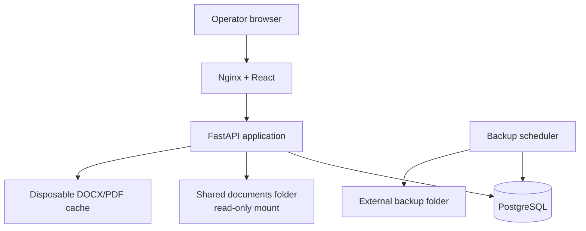
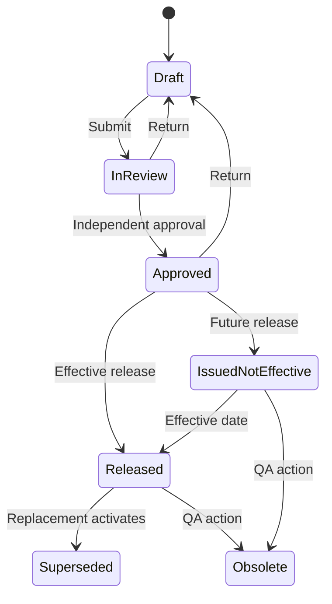

# Architecture

## Deployment topology

The shared folder remains authoritative for PDF/DOCX content. The application stores a relative path, size, modified time and SHA-256 fingerprint. The Docker mount is read-only, so creation or amendment of source documents remains in Eaststone's existing controlled shared-folder process.

## Document lifecycle

An authorised controller can refresh the file fingerprint only while a version is `DRAFT`. Submission, approval, release, viewing and acknowledgement re-check the current source hash. A mismatch after draft control blocks the operation and creates an audit event.

## Training derivation

1. A job role is assigned one or more active document-family requirements.
2. A user receives effective-dated job roles.
3. When a released version becomes effective, each active in-scope user receives one assignment for that exact version.
4. Multiple roles requiring the same version produce one assignment with multiple requirement sources.
5. A view event for the exact file hash must exist before acknowledgement.
6. Password re-authentication creates an immutable acknowledgement bound to user, session, assignment, version and SHA-256.
7. A replacement version supersedes the old version, cancels incomplete old assignments and creates retraining assignments when the revision is marked `RETRAIN`.

`REFERENCE_ONLY` and `CONTROLLED_COPY` role mappings appear in the curriculum but do not create read-and-understand assignments. Physical controlled copies are tracked separately by copy number, department and location.

## Training status presentation

| User-facing label | System representation |
|---|---|
| Reading required | Current assignment is assigned and within its due date |
| Read and acknowledged | Current or historical assignment has an attributable acknowledgement |
| Reading overdue | Current assignment remains incomplete after its due date |
| Reference only | The role mapping is informational and creates no acknowledgement assignment |
| No assignment | No assignment exists for the current effective version and operator |
| Closed — superseded before completion | An incomplete historical assignment was closed when its version was superseded |
| Waived | An authorised person waived the assignment with a recorded reason |

The interface uses these plain-language labels throughout the live matrix and training history. Historical assignment state and acknowledgement evidence remain stored independently of display wording.

## Core entities

- `SecurityRole`, `Permission`, `RolePermission`, `User`, `AuthSession`
- `JobRole`, `UserJobRole`
- `DocumentFamily`, `DocumentVersion`, `VersionSignature`
- `RoleDocumentRequirement`, `TrainingAssignment`, `AssignmentSource`, `TrainingAcknowledgement`
- `ControlledCopyIssue`
- `AuditEvent`, `SystemSetting`, `BackupRun`

## Trust boundaries

- Identity and permission checks execute in the API for every protected operation.
- Operator clients never receive the shared-folder source path unless their role has document-control access.
- Original source download requires a separate permission.
- Normal operators can view only released/effective versions.
- The web interface omits print/download controls, adds a user watermark and serves `no-store` responses. Browser controls reduce casual copying but cannot guarantee DRM against screenshots or a compromised workstation.
- Nginx and API add restrictive frame, MIME, referrer, cache and content security headers.

## Technology decisions

| Layer | Choice | Reason |
|---|---|---|
| API | Python, FastAPI, SQLAlchemy | Clear domain services, validation and testability |
| Database | PostgreSQL 16 | Transactions, partial indexes, append-only triggers and robust backup tools |
| Web | React 19, TypeScript, Vite | Responsive operator and administration interface |
| Document view | PDF.js + LibreOffice headless | Native PDF display and disposable DOCX rendition |
| Deployment | Docker Compose + Nginx | Reproducible on-premises server installation |
| Schema | Alembic | Forward-controlled database upgrades |
| Password hashing | Argon2 | Memory-hard credential protection |
